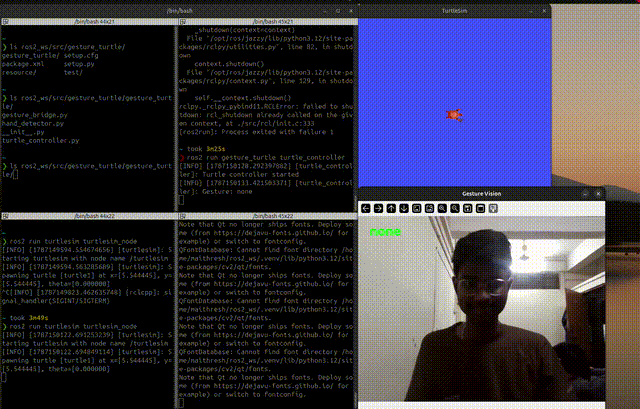

# ✋ Gesture-Controlled Turtle — ROS 2 + OpenCV + MediaPipe

A real-time computer-vision project that uses **hand gestures captured through a webcam to control a ROS 2 turtlesim robot**.

The project combines:

- **ROS 2 Jazzy** for robot communication and control
- **OpenCV** for webcam capture and image processing
- **MediaPipe Gesture Recognizer** for hand gesture detection
- **Python virtual environments** for isolating computer-vision dependencies
- **ROS 2 topics and messages** for communication between perception and control
- **turtlesim** as the simulated robot



---

## 📌 Project Overview

The goal of this project is to control a simulated robot without using a keyboard or joystick.

A webcam observes the user's hand, MediaPipe recognizes predefined gestures, and those gestures are converted into robot movement commands.

### Gesture → Robot Command

| Gesture | MediaPipe Label | Command | Turtle Action |
|:---:|---|---|---|
| ✋ | `Open_Palm` | `forward` | Move forward |
| ✊ | `Closed_Fist` | `stop` | Stop |
| 👍 | `Thumb_Up` | `left` | Rotate left |
| ✌️ | `Victory` | `right` | Rotate right |

---

# 🧠 System Architecture

The complete system is divided into two parts:

### Computer Vision

Runs inside a dedicated Python virtual environment because MediaPipe and OpenCV have their own Python dependencies.

### ROS 2

Runs using the normal ROS 2 Python environment and handles communication and robot control.

```text
                    ┌─────────────────────┐
                    │       Webcam        │
                    └──────────┬──────────┘
                               │
                               ▼
                    ┌─────────────────────┐
                    │       OpenCV        │
                    │   Frame Capture     │
                    └──────────┬──────────┘
                               │
                               ▼
                    ┌─────────────────────┐
                    │      MediaPipe      │
                    │  Gesture Recognizer │
                    └──────────┬──────────┘
                               │
                               ▼
                    ┌─────────────────────┐
                    │  gesture_vision.py  │
                    │                     │
                    │ Gesture → Command   │
                    └──────────┬──────────┘
                               │
                         stdout / pipe
                               │
                               ▼
                    ┌─────────────────────┐
                    │  gesture_bridge.py  │
                    │       ROS 2 Node    │
                    └──────────┬──────────┘
                               │
                        /gesture
                     std_msgs/String
                               │
                               ▼
                    ┌─────────────────────┐
                    │ turtle_controller.py│
                    │       ROS 2 Node    │
                    └──────────┬──────────┘
                               │
                     /turtle1/cmd_vel
                   geometry_msgs/Twist
                               │
                               ▼
                    ┌─────────────────────┐
                    │      turtlesim      │
                    │         🐢          │
                    └─────────────────────┘


🔄 Complete Data Flow

For example, when the user shows an open palm:

1. Webcam
      ↓
2. OpenCV captures frame
      ↓
3. MediaPipe recognizes Open_Palm
      ↓
4. gesture_vision.py maps it to "forward"
      ↓
5. "forward" is printed to stdout
      ↓
6. gesture_bridge.py reads stdout
      ↓
7. Publishes "forward" on /gesture
      ↓
8. turtle_controller.py receives "forward"
      ↓
9. Creates a Twist message
      ↓
10. Publishes Twist on /turtle1/cmd_vel
      ↓
11. turtlesim moves forward


📁 Project Structure
gesture_turtle/
│
├── gesture_turtle/
│   ├── __init__.py
│   ├── gesture_vision.py
│   ├── gesture_bridge.py
│   └── turtle_controller.py
│
├── resource/
│   └── gesture_turtle
│
├── test/
│   ├── test_copyright.py
│   ├── test_flake8.py
│   └── test_pep257.py
│
├── .gitignore
├── demo.gif
├── package.xml
├── setup.cfg
├── setup.py
└── README.md


🐍 Python Virtual Environment

One of the main technical challenges in this project was integrating MediaPipe with ROS 2 Jazzy's Python environment.

MediaPipe and OpenCV were installed inside:

~/ros2_ws/.venv/

while ROS 2 uses the system Python environment.

The final project intentionally keeps these environments separate.

Initially, the idea was to make the ROS node directly import MediaPipe:

import mediapipe

However, when running the ROS executable, Python reported:

ModuleNotFoundError: No module named 'mediapipe'

Checking the Python interpreters showed the problem:

python
/home/maithresh/ros2_ws/.venv/bin/python


ros2
/opt/ros/jazzy/bin/ros2

The ROS-generated Python executable was using:

/usr/bin/python3

while MediaPipe was installed in:

~/ros2_ws/.venv/

Activating the virtual environment did not change the interpreter used by the already-installed ROS executable.

⚠️ Another Problem: System Python Package Installation

Ubuntu 24.04 protects the system Python environment using PEP 668.

Trying to install MediaPipe directly using:

python3 -m pip install mediapipe

resulted in:

error: externally-managed-environment

Using --break-system-packages was also undesirable because it could modify packages used by the system and ROS.

We also encountered a NumPy compatibility problem when MediaPipe was installed outside the isolated environment.

The error indicated that some installed modules had been compiled against NumPy 1.x while the environment contained NumPy 2.x.

Rather than modifying system packages and potentially breaking ROS dependencies, the computer vision stack was isolated.

✅ Final Solution: Separate Python Processes

The final architecture is:

┌─────────────────────────────────────┐
│       Python Virtual Environment    │
│                                     │
│  MediaPipe                          │
│  OpenCV                             │
│  NumPy                              │
│                                     │
│  gesture_vision.py                  │
└──────────────────┬──────────────────┘
                   │
                   │ stdout
                   ▼
┌─────────────────────────────────────┐
│          ROS 2 Environment          │
│                                     │
│  rclpy                              │
│  std_msgs                            │
│  geometry_msgs                       │
│                                     │
│  gesture_bridge.py                  │
│  turtle_controller.py               │
└─────────────────────────────────────┘

The two environments communicate through a simple process interface.

This avoids forcing MediaPipe dependencies into ROS 2's Python environment.


⚙️ Installation
Requirements
Ubuntu 24.04
ROS 2 Jazzy
Python 3.12
Webcam
OpenCV
MediaPipe
turtlesim
colcon

1. Create / use a ROS 2 workspace
mkdir -p ~/ros2_ws/src
cd ~/ros2_ws/src

Clone the repository:

git clone <YOUR_REPOSITORY_URL>

The package should be located at:

~/ros2_ws/src/gesture_turtle

2. Create the Python Virtual Environment

From the ROS workspace:

cd ~/ros2_ws

Create the environment:

python3 -m venv .venv

Activate it:

source .venv/bin/activate

Install the computer vision dependencies:

python -m pip install mediapipe opencv-python

Verify MediaPipe:

python -c "import mediapipe; print(mediapipe.__version__)"

Verify OpenCV:

python -c "import cv2; print(cv2.__version__)"

3. MediaPipe Model

The project requires the MediaPipe Gesture Recognizer model:

gesture_recognizer.task

The model is intentionally not committed to this repository.

Place it locally at:

~/ros2_ws/models/gesture_recognizer.task

The resulting workspace should look like:

ros2_ws/
├── .venv/
├── models/
│   └── gesture_recognizer.task
└── src/
    └── gesture_turtle/

The .task files are excluded using .gitignore.

4. Build the ROS Package

Deactivate the virtual environment:

deactivate

Source ROS 2 Jazzy:

source /opt/ros/jazzy/setup.bash

Build the package:

cd ~/ros2_ws
colcon build --packages-select gesture_turtle

Source the workspace:

source ~/ros2_ws/install/setup.bash
▶️ Running the Project

The project currently uses three terminals.

Terminal 1 — Start turtlesim
source /opt/ros/jazzy/setup.bash
ros2 run turtlesim turtlesim_node

This starts the simulated turtle.

Terminal 2 — Start the Controller
source /opt/ros/jazzy/setup.bash
source ~/ros2_ws/install/setup.bash


ros2 run gesture_turtle turtle_controller

The controller subscribes to:

/gesture
Terminal 3 — Start the Gesture Bridge
source /opt/ros/jazzy/setup.bash
source ~/ros2_ws/install/setup.bash


ros2 run gesture_turtle gesture_bridge

The webcam window should open.

Perform the gestures and observe the turtle.

🧪 Testing Individual Components
Test Gesture Recognition Without ROS

Activate the virtual environment:

cd ~/ros2_ws
source .venv/bin/activate

Run:

python src/gesture_turtle/gesture_turtle/gesture_vision.py

The webcam window should open and gesture commands should be detected.

Example:

forward
stop
left
right

Press q to close the camera.


🔐 Repository Hygiene

The repository intentionally does not contain:

.venv/
build/
install/
log/
*.task

These are either:

generated build artifacts
local Python environments
machine-specific dependencies
large binary model files

The repository therefore contains the source code and configuration required to understand and reproduce the project, rather than the entire development environment.

